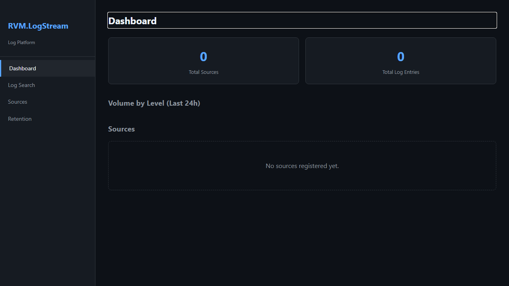
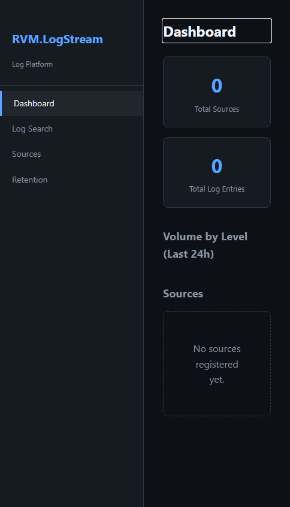
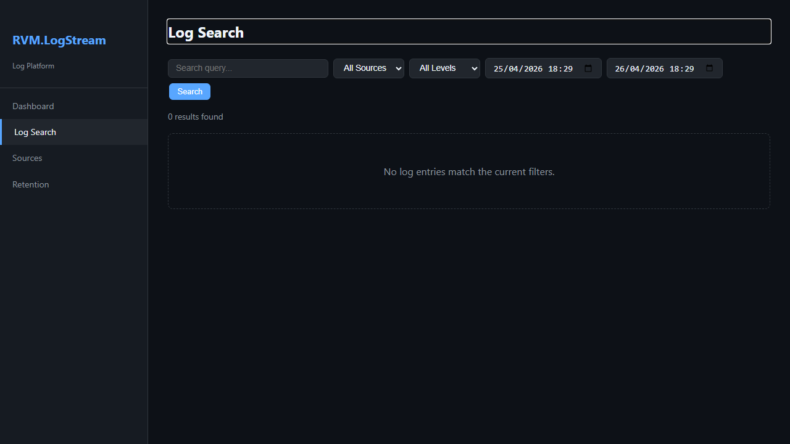
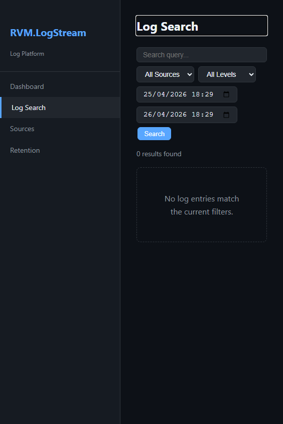
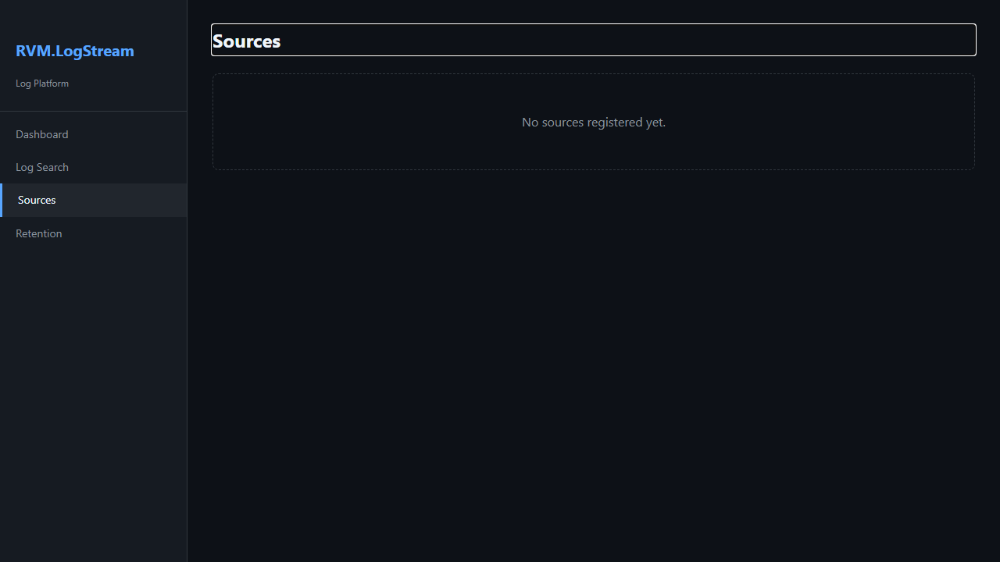
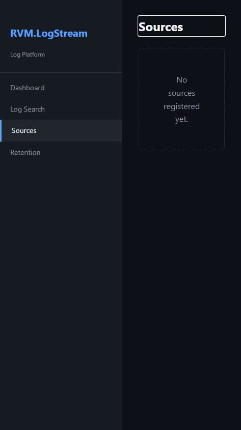
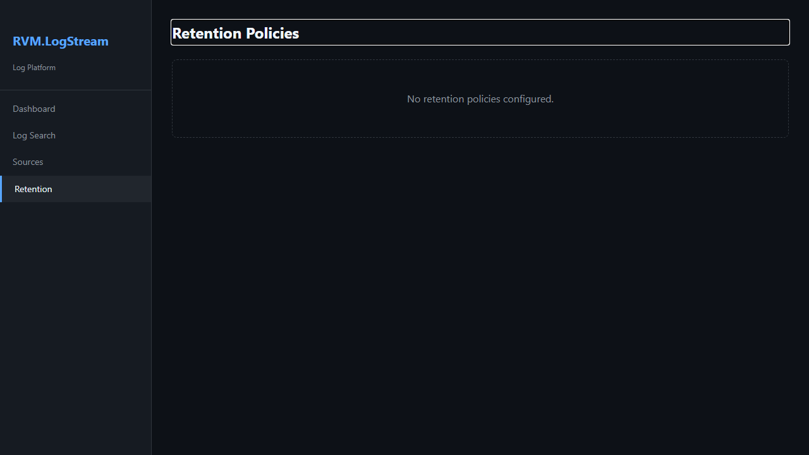
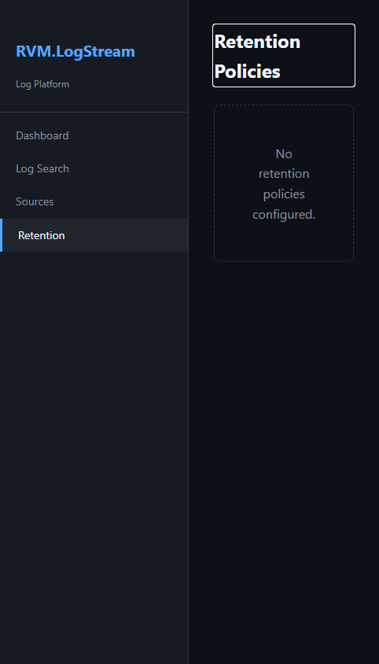

# RVM.LogStream - Manual do Usuario

> Logs Centralizados com Busca e Retencao — Guia Completo de Funcionalidades
>
> Gerado em 26/04/2026 | RVM Tech

---

## Visao Geral

O **RVM.LogStream** centraliza logs de multiplos servicos com busca full-text e retencao configuravel.

**Recursos principais:**
- **Ingestao via API** — individual ou batch, autenticado por API Key
- **Busca full-text** — filtros por nivel, fonte, periodo e texto
- **Dashboard real-time** — volume e anomalias via SignalR
- **Retencao configuravel** — por nivel de log e por fonte
- **Exportacao** — resultados em JSON ou CSV

---

## 1. Dashboard de Logs

Painel central com visao em tempo real do fluxo de logs recebidos. Exibe volume por nivel (DEBUG, INFO, WARN, ERROR, FATAL), taxa de ingestao e alertas de anomalias.

**Funcionalidades:**
- Volume de logs por nivel nas ultimas 24h (grafico de barras)
- Taxa de ingestao atual (logs/segundo)
- Top 5 fontes por volume
- Alertas de pico de erros
- Atualizacao em tempo real via SignalR
- Filtro rapido por nivel e periodo

> **Dicas:**
> - Picos no grafico de WARN/ERROR indicam problemas em servicos — clique na barra para ir direto a busca filtrada.

| Desktop | Mobile |
|---------|--------|
|  |  |

---

## 2. Busca de Logs

Interface de busca full-text e filtrada sobre os logs armazenados. Suporta filtros por nivel, fonte, periodo e texto livre. Resultados sao paginados e exportaveis.

**Funcionalidades:**
- Busca full-text na mensagem do log
- Filtros: nivel (DEBUG/INFO/WARN/ERROR/FATAL), fonte, periodo
- Visualizacao do stack trace completo ao expandir
- Exportacao dos resultados em JSON ou CSV
- Paginacao com ate 1000 resultados por pagina
- Destaque de palavras encontradas no texto

> **Dicas:**
> - Use aspas para busca exata: "NullReferenceException" encontra somente essa frase.
> - Combine filtros: nivel=ERROR + fonte=api + "timeout" para investigar falhas especificas.

| Desktop | Mobile |
|---------|--------|
|  |  |

---

## 3. Fontes de Logs

Gerenciamento das fontes de logs registradas. Cada fonte representa um servico ou aplicacao que envia logs para o LogStream via API.

**Funcionalidades:**
- Listagem de fontes ativas e inativas
- Volume de logs por fonte (ultimo 7 dias)
- API Key exclusiva por fonte
- Configuracao de nivel minimo aceito por fonte
- Adicionar, editar e remover fontes
- Status de conectividade (ultimo log recebido)

> **Dicas:**
> - Defina nivel minimo "INFO" em producao para evitar sobrecarga com logs DEBUG.
> - Cada fonte tem sua propria API Key — revogue separadamente se comprometida.

| Desktop | Mobile |
|---------|--------|
|  |  |

---

## 4. Politica de Retencao

Configuracao de quanto tempo cada tipo de log e mantido no banco de dados. Logs expirados sao removidos automaticamente pelo worker de limpeza.

**Funcionalidades:**
- Retencao configuravel por nivel de log (dias)
- Retencao diferenciada por fonte
- Estimativa de espaco ocupado atual
- Historico de execucoes do cleanup
- Execucao manual do cleanup (forcada)
- Alertas quando o volume supera o threshold configurado

> **Dicas:**
> - Mantenha logs ERROR e FATAL por pelo menos 90 dias para pos-mortem.
> - Logs DEBUG podem ter retencao curta (1-7 dias) para economizar espaco.

| Desktop | Mobile |
|---------|--------|
|  |  |

---

## 5. API de Ingestao de Logs

Endpoint REST para envio de logs pelos servicos clientes. Suporta envio individual e em lote (batch). Autenticacao via API Key no header.

**Funcionalidades:**
- POST /api/logs — ingestao individual ou batch (ate 1000 logs por chamada)
- GET /api/logs — consulta com filtros (nivel, fonte, periodo, texto)
- Campos: nivel, mensagem, fonte, timestamp, propriedades extras (JSON)
- Autenticacao via header X-Api-Key
- Rate limiting: 500 req/min por chave
- Resposta com ID de cada log ingerido

> **Dicas:**
> - Use batch para alta vazao — uma chamada com 100 logs e muito mais eficiente que 100 chamadas.

| Desktop | Mobile |
|---------|--------|
|  |  |

---

## 6. Estatisticas

Relatorios e estatisticas de uso do LogStream: volume historico, distribuicao por nivel e por fonte, e tendencias de crescimento.

**Funcionalidades:**
- Volume total de logs por periodo (7, 30, 90 dias)
- Distribuicao percentual por nivel
- Top 10 fontes por volume
- Taxa de crescimento semanal
- Estimativa de crescimento futuro
- Exportacao de relatorio em PDF

| Desktop | Mobile |
|---------|--------|
|  |  |

---

## Informacoes Tecnicas

| Item | Detalhe |
|------|---------|
| **Tecnologia** | ASP.NET Core + Blazor Server |
| **Tempo real** | SignalR (WebSocket) |
| **Banco de dados** | PostgreSQL 16 |
| **Busca** | Full-text nativo PostgreSQL (tsvector) |
| **Autenticacao** | API Key por fonte |

---

*Documento gerado automaticamente com Playwright + TypeScript — RVM Tech*
